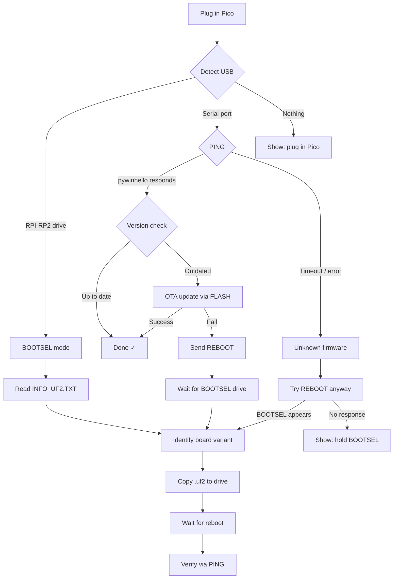

# Hardware

## What devices are supported?

Any Raspberry Pi Pico variant. All use Adafruit VID `0x239A`.

| Board | USB PID(s) | Chip | WiFi | Recommended |
|-------|-----------|------|------|-------------|
| Pico | 0x80F4 | RP2040 | No | |
| Pico H | 0x80F4 | RP2040 | No | |
| Pico W | 0x8058, 0x8120 | RP2040 | Yes | ★ |
| Pico 2 | 0x8150 | RP2350 | No | |
| Pico 2 W | 0x8160 | RP2350 | Yes | ★ |

## Why Pico W?

WiFi models add two features that non-W models can't do:

1. **NTP time sync** — the Pico knows the actual time, enabling independent scheduled actions
2. **USB remote wakeup** — the Pico can wake the PC from S3 sleep at the scheduled time without needing Windows Task Scheduler

Non-W models still support scheduled wake via Windows Task Scheduler (the PC monitor creates the task). The Pico W version is more reliable because it doesn't depend on the PC's clock.

## Firmware

The firmware is written in C using the Pico SDK. This gives:

- **Dual USB interface** — HID keyboard + CDC serial on one connection
- **AES-256 encrypted PIN** — key derived from Pico's unique hardware ID
- **LittleFS persistent storage** — config, PIN, and event log survive power cycles
- **Single binary** — auto-detects W vs non-W by probing the CYW43 WiFi chip
- **OTA updates** — firmware can be updated over serial without BOOTSEL

### USB interfaces

The Pico presents two USB interfaces simultaneously:

| Interface | Purpose |
|-----------|---------|
| HID Keyboard | Types PIN characters, Enter, Escape, Tab, Shift |
| CDC Serial | Receives commands from PC (PING, UNLOCK, HELLO, etc.) |

### Storage layout

```
Pico flash (2MB)
├── Firmware (partition A)     — active firmware
├── Firmware (partition B)     — staging for OTA updates
└── LittleFS (last 256KB)
    ├── config.json            — schedule, timing, apps, locale
    ├── pin.enc                — AES-256 encrypted PIN
    └── log.bin                — circular event log (20 entries)
```

### PIN security

- Encrypted with AES-256 using a key derived from the RP2040's unique board ID + salt via HKDF
- PIN is decrypted only into RAM when typing, then wiped
- No `GET_PIN` serial command exists — the PIN never leaves the Pico
- `SETUP_PIN` sends cleartext over local USB serial (acceptable: physical access required)

## Setup Flow

The setup wizard automates firmware provisioning for every Pico state — no manual button presses needed for the standard case.

### Provisioning decision tree



### Pico state matrix

| Pico State | What setup.exe does | User action needed |
|------------|--------------------|--------------------|
| Brand new (blank flash) | Auto-enters BOOTSEL → flash UF2 → verify | Just plug in |
| Running pywinhello (current) | Reports "up to date" | None |
| Running pywinhello (outdated) | OTA update over serial | None |
| Running pywinhello (OTA fails) | REBOOT → BOOTSEL → flash UF2 | None |
| Running old pywinhello (no REBOOT) | Try REBOOT (fails), show instructions | One-time BOOTSEL re-flash |
| Running other firmware | Try REBOOT, fall back to instructions | One-time BOOTSEL re-flash |
| Not detected | Prompt to plug in | Plug in Pico |

!!! note "One-time BOOTSEL re-flash"
    If your Pico is running old pywinhello firmware (before REBOOT support)
    or third-party firmware, a one-time manual step is needed:

    1. Unplug the Pico
    2. Hold the **BOOTSEL** button (white button on the board)
    3. While holding, plug the USB cable back in
    4. Release the button — an **RPI-RP2** drive appears
    5. Re-run the setup wizard — it flashes automatically

    After this, all future updates are fully automated.

### What happens under the hood

1. **Blank Pico** — RP2040/RP2350 ROM bootloader runs when flash is empty, exposing an `RPI-RP2` mass storage drive automatically. The wizard detects this drive, reads `INFO_UF2.TXT` to identify the board variant, copies the correct `.uf2` firmware, and waits for reboot.

2. **OTA updates** — the firmware has a dual-partition (A/B) flash layout with a serial `FLASH` command. The PC streams the new firmware binary, the Pico writes it to the staging partition, verifies the SHA-256 hash, swaps partitions, and reboots.

3. **REBOOT recovery** — the firmware supports a `REBOOT` serial command that calls `reset_usb_boot()` to re-enter BOOTSEL mode. This enables fully automated recovery and re-flashing without physical button presses.

### Serial protocol

| Command | Response | Description |
|---------|----------|-------------|
| `PING` | `OK:pico_w,1.0.0` | Device type + firmware version |
| `GET_CONFIG` | `OK:{json}` | Read full config |
| `SET_CONFIG:{json}` | `OK` | Write config |
| `SETUP_PIN:{pin}` | `OK` | Store encrypted PIN |
| `CLEAR` | `OK` | Wipe PIN + config + log |
| `UNLOCK` | `OK` | Type stored PIN + Enter |
| `HELLO` | `OK` | Type stored PIN (no Enter) |
| `GET_LOG` | `OK:{base64}` | Read event log |
| `FLASH:{size}` | `READY` | Begin OTA (then stream binary) |
| `REBOOT` | `OK` | Enter BOOTSEL mode |
| `STATUS` | `OK:{json}` | Device status |

## Troubleshooting

**RPI-RP2 drive doesn't appear**
: Try a different USB cable. Charge-only cables don't expose the drive. Hold BOOTSEL *before* plugging in.

**Pico not detected after flashing**
: Wait 5-10 seconds for USB re-enumeration. Check Device Manager → Ports (COM & LPT) for a new COM port.

**PIN entry types wrong characters**
: The firmware uses US keyboard layout for HID reports. PIN digits (0-9) are unaffected by keyboard layout, but special characters may differ.

**Two COM ports in Device Manager**
: The firmware uses a single COM port for CDC serial alongside the HID interface. If you see two, it may be from prior firmware.
