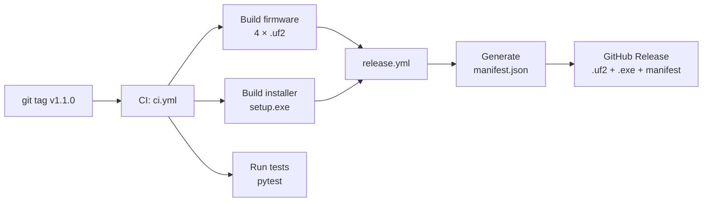
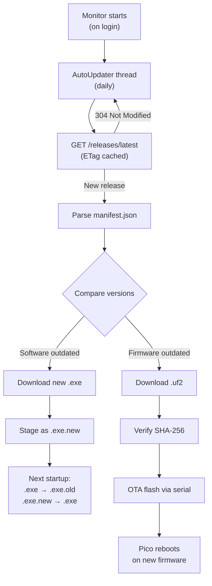

# Update Workflow

## How updates ship

When you push a git tag (`v1.1.0`), CI builds everything and creates a GitHub Release automatically.



### What CI produces

| Artifact | Contents | Purpose |
|----------|----------|---------|
| `pywinhello_setup.exe` | Installer (Inno Setup) | End-user download |
| `pywinhello_pico.uf2` | RP2040 firmware | Pico, Pico H |
| `pywinhello_pico_w.uf2` | RP2040 firmware | Pico W |
| `pywinhello_pico2.uf2` | RP2350 firmware | Pico 2 |
| `pywinhello_pico2_w.uf2` | RP2350 firmware | Pico 2 W |
| `manifest.json` | Version + SHA-256 hashes | Auto-updater uses this |

### manifest.json format

```json
{
  "version": "1.1.0",
  "software_version": "1.1.0",
  "firmware_version": "1.1.0",
  "firmware_hash_rp2040": "sha256:abc123...",
  "firmware_hash_rp2350": "sha256:def456...",
  "force_update": false,
  "min_protocol_version": 2
}
```

## Auto-update (end users)

End users never manually update. The background monitor checks GitHub once per day and applies updates silently.



### Software update (PC side)

Rename-on-restart pattern — no admin rights needed, no downtime:

1. Monitor downloads new `pywinhello-monitor.exe`
2. Saves as `.exe.new` next to the running exe
3. On next startup, `cleanup_old_update()` renames:
    - `monitor.exe` → `monitor.exe.old`
    - `monitor.exe.new` → `monitor.exe`
    - Deletes `.exe.old`

### Firmware update (Pico side)

OTA over serial — no unplugging, no buttons:

1. Monitor downloads correct `.uf2` for the board's chip (RP2040 or RP2350)
2. Verifies SHA-256 hash from manifest
3. Sends `FLASH:{size}` command over serial
4. Streams firmware binary in 4KB chunks
5. Appends SHA-256 hash (32 bytes) at the end
6. Pico writes to staging partition, verifies hash, swaps partitions, reboots
7. New firmware must send `BOOT_OK` within 10 seconds
8. If no `BOOT_OK` after 2 boots → auto-rollback

## Firmware flash layout (A/B partitions)

The Pico's 2MB flash is split into partitions for safe OTA updates:

```
┌──────────────────────────────────────────────────┐
│ Partition A (1MB)        0x000000 – 0x100000     │
│ Active firmware                                  │
├──────────────────────────────────────────────────┤
│ Partition B (768KB)      0x100000 – 0x1C0000     │
│ Staging area for OTA                             │
├──────────────────────────────────────────────────┤
│ Boot flags (4KB)         0x1BF000 – 0x1C0000     │
│ Active partition, pending_verify, boot_count     │
├──────────────────────────────────────────────────┤
│ LittleFS (256KB)         0x1C0000 – 0x200000     │
│ config.json, pin.enc, log.bin                    │
└──────────────────────────────────────────────────┘
```

### Why A/B?

OTA can fail (power loss, bad binary, bug in new firmware). A/B partitions make it safe:

| Step | What happens |
|------|--------------|
| 1. Flash received | New firmware written to **inactive** partition (B) |
| 2. Hash verified | SHA-256 of written data matches expected hash |
| 3. Swap + reboot | Boot flags updated: active=B, pending_verify=true |
| 4. New firmware boots | Has 10 seconds to send `BOOT_OK` serial command |
| 5a. `BOOT_OK` received | pending_verify cleared — update confirmed |
| 5b. No `BOOT_OK` × 2 boots | Auto-rollback: swap back to A, reboot |

**Result**: a bad firmware update never bricks the Pico. Worst case = rolls back to previous working version.

## Version strategy

Software (PC) and firmware (Pico) share the same version number, set by the git tag. This keeps things simple:

- `BUNDLED_FW_VERSION` in `setup/__init__.py` = version bundled with the installer
- `FW_VERSION_STRING` in `firmware/include/pywinhello.h` = version compiled into firmware
- `manifest.json` in GitHub Release = version the auto-updater compares against
- All three must match for a given release

## Developer: building firmware locally

Only needed if you're actively editing firmware C code. Otherwise, let CI build it.

```bash
# 1. Clone Pico SDK
git clone --depth 1 -b 1.5.1 https://github.com/raspberrypi/pico-sdk.git /tmp/pico-sdk
cd /tmp/pico-sdk && git submodule update --init

# 2. Set environment
export PICO_SDK_PATH=/tmp/pico-sdk

# 3. Build
cd firmware
mkdir build && cd build
cmake ..
make -j$(nproc)

# 4. Output: pywinhello_pico.uf2, pywinhello_pico_w.uf2, etc.
```

For testing the setup wizard with locally built firmware, copy the `.uf2` files to `pc/src/pywinhello/_data/firmware/`.
